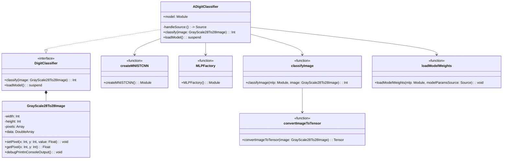

# MNIST Demo Project Structure Analysis

## Current Structure

The MNIST Demo project is organized into two main packages within the shared module:

1. `com.kkon.kmp.mnist.demo` - Contains application-specific code for the MNIST demo
2. `com.kkon.kmp.mnist.nn` - Contains neural network related code

### Package: com.kkon.kmp.mnist.demo

This package contains:

- **BatchTraining.kt**: Utility functions for batch training on the MNIST dataset
- **Constants.kt**: Simple constants used in the application
- **DigitClassifierModel.kt**: Interface for digit classification and a class for representing grayscale images
- **ModelData.kt**: Implementation of the DigitClassifier interface using neural networks

### Package: com.kkon.kmp.mnist.nn

This package contains:

- **CNNModelFactory.kt**: Function to create a Convolutional Neural Network for MNIST classification
- **Clasifier.kt**: Function to classify images using a neural network
- **ImageCOnverter.kt**: Functions to convert images to tensors and load model weights
- **MLPModelFactory.kt**: Function to create a Multi-Layer Perceptron for MNIST classification

## Class Structure and Dependencies



## Issues with Current Structure

1. **Inconsistent Naming**: 
   - File names have inconsistent capitalization (e.g., `ImageCOnverter.kt`)
   - Some files have typos in their names (e.g., `Clasifier.kt` instead of `Classifier.kt`)

2. **Unclear Package Organization**:
   - The separation between "demo" and "nn" packages is not clearly defined
   - Some functionality that should be in the "nn" package is referenced in the "demo" package

3. **Lack of Clear Abstraction Layers**:
   - The code mixes high-level application logic with low-level neural network implementation details
   - There's no clear separation between model definition, data processing, and application logic

4. **Inconsistent Function vs Class Usage**:
   - Some components are implemented as functions (e.g., `MLPFactory()`, `createMNISTCNN()`)
   - Others are implemented as classes (e.g., `ADigitClassifier`)

## Suggested Improvements

### 1. Reorganize Package Structure

```
com.kkon.kmp.mnist/
├── model/                  # Neural network model definitions
│   ├── cnn/                # CNN-specific implementations
│   ├── mlp/                # MLP-specific implementations
│   └── common/             # Shared model components
├── data/                   # Data handling and processing
│   ├── image/              # Image processing utilities
│   └── loader/             # Data loading utilities
├── training/               # Training-related functionality
│   ├── batch/              # Batch processing
│   └── optimizer/          # Optimization algorithms
└── application/            # Application-specific code
    ├── classifier/         # Digit classification
    └── ui/                 # User interface components
```

### 2. Fix Naming Conventions

- Rename `Clasifier.kt` to `Classifier.kt`
- Rename `ImageCOnverter.kt` to `ImageConverter.kt`
- Ensure consistent naming patterns (e.g., all factory classes should end with "Factory")

### 3. Improve Abstraction Layers

- Create proper interfaces for each major component
- Implement dependency injection to reduce tight coupling
- Separate model definition from model usage

### 4. Standardize Implementation Patterns

- Decide whether to use a functional or object-oriented approach consistently
- If using classes, follow proper OOP principles
- If using functions, organize them into logical modules

### 5. Add Documentation

- Add package-level documentation explaining the purpose of each package
- Ensure all public APIs have proper KDoc comments
- Include examples of how to use the major components

By implementing these improvements, the codebase would become more maintainable, easier to understand, and better organized for future development.